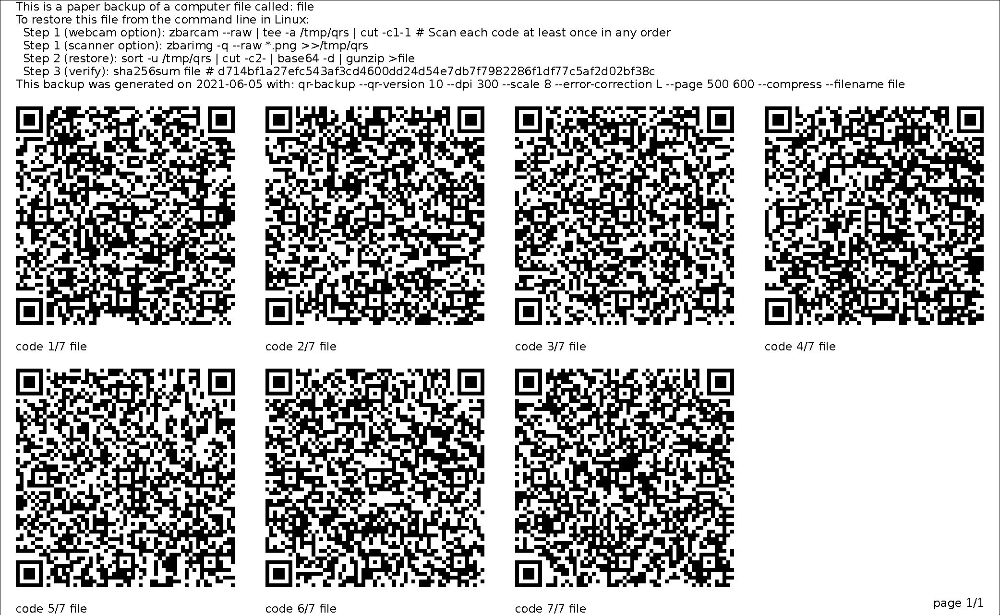

(Not done) Generate paper backups for Linux/Mac.

Takes any file, and outputs a "paper backup": a printable pdf full of QR codes. 

Following the directions in the pdf, the QR codes can be re-scanned or photographed using a webcam to restore the original file.

Test restoring from your paper backup when you make it, NOT when you need it.

## Example Backup

## Instructions
To make a paper backup:

0. Requirements: a printer; python, python-qrcode, imagemagick, img2pdf
1. Run `qr-backup <FILE>`. This makes `<FILE>.qr.pdf`
2. Print `<FILE>.qr.pdf` onto some paper. Now you have a backup. It's a bunch of QR codes and some instructions.

To restore from a paper backup:

0. Requirements: a webcam or scanner; zbar
    - To install zbar in linux, use 'apt-get install zbar' (or whatever your distro uses)
    - To install zbar in OS X, use '[brew](https://brew.sh/) install zbar' (not tested)
1. Using the provided directions in the backup
    - Use a webcam and `zbarcam` to scan the QR codes. 
    - OR, use a scanner and `zbarimg` to scan the QR codes.
3. Run the provided command. Now you have your original file.
4. Verify your file was restored perfectly (using the included checksum).

## TODO
1. Generate a .pdf or .ps file. Currently I generate one .png per page.
2. Properly figure out the maximum printable area
3. Maximize the density a bit more. Properly account for text padding in labels.
4. Allow arbitrary binary data by escaping "\r"
